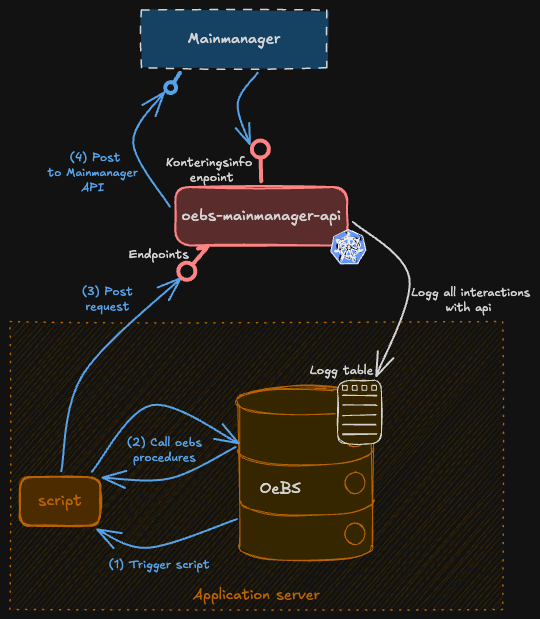

# oebs-mainmanager-api
  
  

REST API service that serves as an integration layer infront of Mainmanager used by OeBS. The service exposes post requested that pushes data to Mainamanger.
Mainmanager is a system handling all properties NAV uses. OeBS is currently the only user of the service, however other systems may use in the future.
Additionally, the service also exposes validate account string endpoint, whitch is used by Mainmanager to validate account strings. 

---

## Architecture

The service acts as a middleware between the external systems Mainmanager and the OEBS Oracle database.
Mainmanager receives data from OEBS via POST endpoints, requested by a script on the application server triggered daily by OeBS.
Additionally, Mainmanager uses the validate account string endpoint to validate account strings.

---

## Functionality

### Instances and OEBS environments
The service currently runs with three instances: t1, q1 and prod. 

### OEBS PL/SQL procedures
#todo: Oppdatere med riktige lenker og beskrivelse på hvordan den er integrert med OeBS

Installation of the packages and log tables in OEBS used by this repository is handled by an [install script](https://github.com/navikt/oebs/blob/main/install/install_IFA_restapi_ve_v1.sh) in the OEBS repository.

The [package specification](https://github.com/navikt/oebs/blob/main/admin/sql/xxrtv_oebs-restapi-ve-v1.pks) and [package body](https://github.com/navikt/oebs/blob/main/admin/sql/xxrtv_oebs-restapi-ve-v1.pkb) are also in the OEBS repository.
The package specification contains the methods called by the services in this repository, and the package body contains their implementations.

---

## Dependencies

| System                   | Purpose                                                     |
|--------------------------|-------------------------------------------------------------|
| **OEBS Oracle Database** | Source of all business data; accessed via PL/SQL stored procedures |
| **Mainmanager REST API** | Used to push data                                           |
| **NAV Token Validation** | OAuth2/JWT security via Azure AD                            |
| **NAIS platform**        | Container orchestration, secrets management, and deployment |

---

## Running Locally

To run the service locally, use the `local` profile and set the following environment variables.
Values for all secrets can be retrieved from the NAIS console for the application `oebs-mainmanager-api-t1`:

- `APPS_USERNAME` – username for OEBS
- `OAPPS_PASSWORD` – password for OEBS
- `DB_URL` – URL for OEBS (change from t1 to u1 at the end)
- `AZURE_DISCOVERY_URL` – discovery URL for the Azure AD app

You must also have connectivity to oebsu1, which is located in the secure zone.
You can either use **vdi-utvikler-oebs** (a VDI set up for development in the secure zone) or the **Global Secure Access Client**.
For more information, see the [oksty developer documentation](https://github.com/navikt/oksty-documentation).

[Swagger UI](http://localhost:8080/swagger-ui/index.html) is available when running locally,
but all endpoints are protected by Entra ID by default. To test endpoints without authentication,
replace the `@Protected` annotation in a controller with `@Unprotected`. 

---

## Testing

Unit tests are set up using JUnit and Mockito. No integration tests are currently configured.

---

## Monitoring and Alerting

No alerting is currently configured. Issues must be detected by users experiencing errors when calling the API, or through observed problems in OEBS that can be traced back to the API.

Standard application monitoring is available via Grafana dashboards:
- [Grafana dashboard for t1](https://grafana.nav.cloud.nais.io/a/nais-apm-app/services/team-oebs/oebs-mainmanager-api-t1?namespace=team-oebs&environment=dev-gcp)
- [Grafana dashboard for q1](https://grafana.nav.cloud.nais.io/a/nais-apm-app/services/team-oebs/oebs-mainmanager-api-q1?namespace=team-oebs&environment=dev-gcp)
- [Grafana dashboard for prod](https://grafana.nav.cloud.nais.io/a/nais-apm-app/services/team-oebs/oebs-mainmanager-api?namespace=team-oebs&environment=prod-gcp)
---

## Deploy

### Branching strategy
- Feature development should happen on dedicated branches with a PR to `main`.
- Merging to `main` triggers deployment to **all environments** (T1, Q1, and production).

### Referencing Jira tasks
Include the Jira task key in the branch name and/or commit message. All PRs are squash-merged into main, so the most important thing is that the Jira issue is referenced in the squash commit message and that the PR title references the Jira issue.
For example, if working on `OEBS-123`, the commit message should include `feat(OEBS-123): new rest endpoint` and the PR title should follow the same format.
If a PR covers multiple Jira issues, all should be referenced, e.g. `feat(OEBS-123, OEBS-124): new rest endpoint and tests`.
All individual commits should be listed in the PR description.

### Deployment pipeline
Deployments are handled by GitHub Actions (`.github/workflows/build-deploy-mainmanager.yaml`).

### Promotion criteria
Before deploying to production:
- All tests must pass (`mvn verify`).
- SonarCloud analysis must not introduce new critical issues.

---

## Documentation

### Swagger / OpenAPI
Swagger UI is available when the application is running:

- [Swagger t1](https://oebs-mainmanager-api-t1.intern.dev.nav.no/swagger-ui/index.html)
- [Swagger q1](https://oebs-mainmanager-api-q1.intern.dev.nav.no/swagger-ui/index.html)
- [Swagger prod](https://oebs-mainmanager.intern.nav.no/swagger-ui/index.html)

### System documentation
- [System documenation in Teams](https://navno.sharepoint.com/:u:/r/sites/VLTEAMOeBS200/Shared%20Documents/Systemdokumentasjon/MainManager/OeBS%20MD-050_070%20eyeshare,%20Vieri%20og%20Main%20Manager%20%E2%80%93%20Valider%20Kontostreng.docx.url?csf=1&web=1&e=IJQe2d)
  (Restricted access)
- [System illustration documented in Teams](https://navno.sharepoint.com/:w:/r/sites/VLTEAMOeBS200/Shared%20Documents/Systemdokumentasjon/MainManager/Mainmanager%20integrasjoner%20pr%2020012025.docx?d=w5f97dea1477f438bb45e86696bef7609&csf=1&web=1&e=8JCJk7)  (Restricted access)

---
